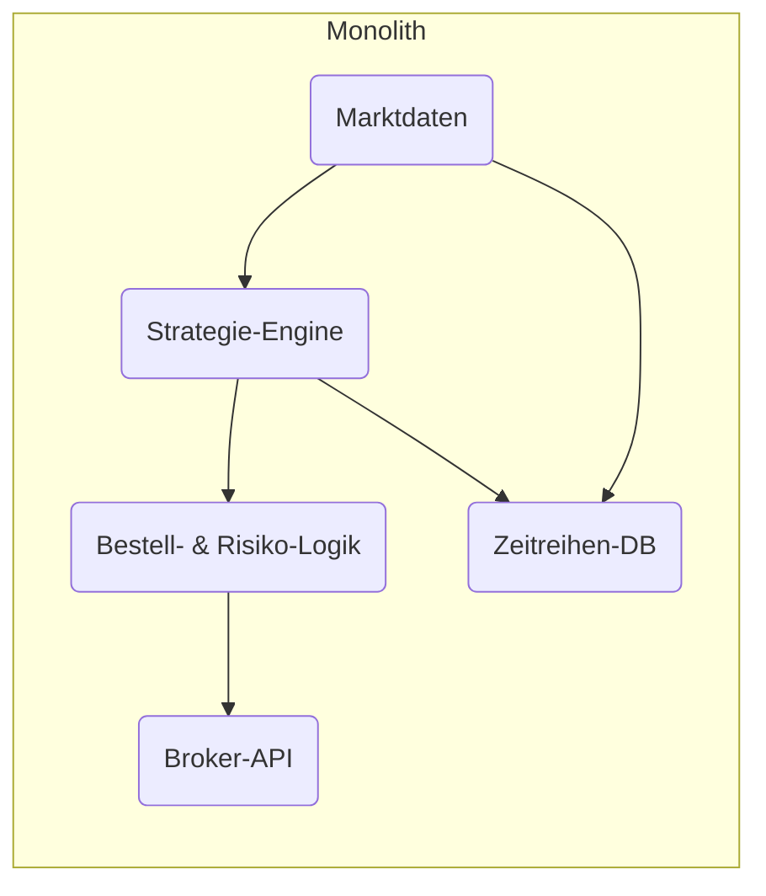
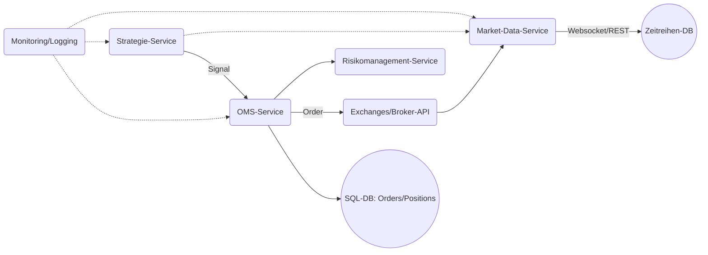
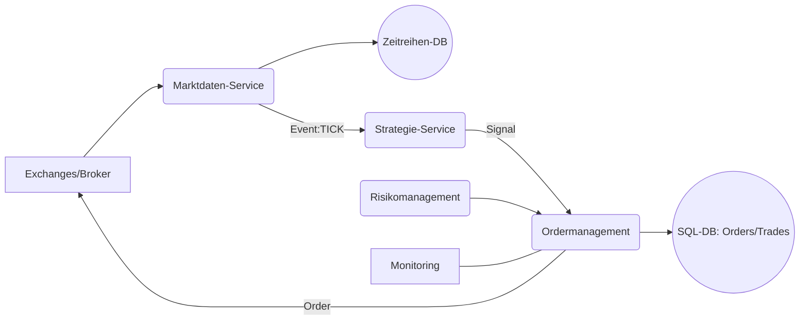

# Zusammenfassung

Der Aufbau eines lokalen, mehrstrategischen Trading-Backends erfordert eine hochskalierbare, fehlertolerante und sichere Architektur, die niedrige Latenz für Strategien wie Scalping garantiert. In dieser Analyse vergleichen wir mehrere Architekturparadigmen (Monolith, Microservices, ereignisgetrieben, Hybrid) hinsichtlich Performance, Komplexität und Kosten, untermauert durch moderne Quellen. Wir empfehlen Technologien (Programmiersprachen, Frameworks, Message-Broker, Zeitreihen- und relationale Datenbanken, In-Memory-Stores, Containerisierung, CI/CD, Monitoring) und geben konkrete Umsetzungs- und Roadmap-Schritte. Dabei berücksichtigen wir die Anbindung an verschiedene Datenquellen (Marktdaten, historische Daten, Broker-APIs, alternative Daten) sowie Anforderungen an Skalierbarkeit, Sicherheit und Risiko­kontrollen (Order-Throttling, Circuit Breaker). 

| **Architektur-Stil**           | **Vorteile**                                        | **Nachteile**                                         | **Performance**                            | **Komplexität**                | **Betriebskosten**                |
|-------------------------------|----------------------------------------------------|-------------------------------------------------------|--------------------------------------------|-------------------------------|-----------------------------------|
| **Monolith**                  | Einfache Entwicklung, geringe Kommunikationsoverhead【26†L60-L68】. Gute Performance ohne Netzwerk-Latenzen【26†L68-L72】. | Skalierung nur durch komplette Replikation (ineffizient)【26†L75-L84】. Ein Fehler kann Gesamtsystem ausfallen【26†L89-L92】. Technologie-Lock-in, langsame Deploys. | Gut bei niedriger Last; Engpass bei hohem Verkehrsaufkommen. | Gering (weniger Komponenten)     | Niedrig (wenig Infrastruktur)     |
| **Microservices**             | Skalierung pro Dienst; Ausfall isoliert (fehlerfeste Services)【24†L73-L82】【24†L135-L144】. Schnelle parallele Entwicklung (CI/CD)【24†L146-L155】. Flexible Technologiewahl pro Service【24†L129-L133】. | Hohe Systemkomplexität; Netzwerk-Overhead, Latenz durch Service-Kommunikation【24†L171-L180】. Monitoring und DevOps-Aufwand steigen【24†L171-L180】. | Sehr hoch skalierbar; Engpässe verteilter Last geschickt aufteilbar【24†L123-L132】. | Hoch (Verwaltung vieler Services) | Mittel bis hoch (mehr Server/Cluster) |
| **Ereignisgetrieben (EDA)**   | Lose Kopplung, asynchroner Datenaustausch. Einfache Erweiterbarkeit (neue Event-Handler)【5†L52-L60】. Nachvollziehbarkeit durch Event-Logs. | Eventual Consistency (Events nicht sofort geordnet). Debugging komplexer. Zusätzlicher Aufwand für Event-Broker. | Sehr reaktiv; Einsatz von Message-Brokern (z.B. Kafka) für hohe Durchsatzraten. | Mittel bis hoch (Event-Infrastruktur) | Mittel (Broker-Cluster, Infrastruktur) |
| **Hybrid (Microservices+EDA)**| Kombiniert Vorteile: unabhängige Dienste plus ereignisgesteuerte Kommunikation. Sehr skalierbar und flexibel. | Vereint Komplexität beider Ansätze. Höchster Aufwand in Planung und Betrieb. | Höchst skalierbar; gut für unterschiedliche Lastmuster. | Sehr hoch                        | Hoch                              |

Quellen zeigen, dass moderne Trading-Plattformen oft Microservices wählen, um bei Spitzenlast (z.B. Marktdatenspitzen) gezielt einzelne Dienste hochzufahren【24†L73-L82】【24†L123-L132】. EDA erhöht dabei Nachvollziehbarkeit und Erweiterbarkeit durch klar definierte Events【5†L52-L60】. Monolithen eignen sich nur für kleinere, weniger zeitkritische Projekte, da sie weniger wartbar und schwer skalierbar sind【26†L75-L84】【26†L89-L92】.

【5†L52-L60】【24†L73-L82】

## Architekturentwürfe


*Monolithische Architektur: Alle Komponenten (Marktdaten, Strategie, Order/Risiko) in einem Prozess.*


*Microservices-/ereignisgetriebene Architektur: Spezialisierte Dienste kommunizieren (z.B. via Events/REST/Kafka).*

## Datenbanktechnologie

Für Marktdaten und historische Kurse bieten sich spezialisierte Zeitreihendatenbanken (TSDB) an. Kdb+ (von Kx Systems) ist in der Finanzbranche für HFT bewährt【15†L369-L377】. Open-Source-Alternativen sind TimescaleDB (PostgreSQL-Erweiterung), QuestDB oder InfluxDB. Diese sind optimiert auf hohe Schreibraten, Kompression und Zeit-Funktionalität. Im Vergleich dazu sind klassische relationale DBs (PostgreSQL, MySQL) universell einsetzbar, aber weniger performant für Massendatenströme【15†L269-L277】.  

| **DB**              | **Typ**             | **Vorteile**                                 | **Nachteile**                          |
|---------------------|---------------------|----------------------------------------------|----------------------------------------|
| **Kdb+/q**          | TSDB, In-Memory    | Extrem schnell, OLAP-Fokus auf Zeitreihen【15†L369-L377】 | Lizensiert, proprietär, hohe Lernkurve |
| **TimescaleDB**     | TSDB (Postgres)    | Kompatibel zu PostgreSQL, Hypertables für Partitionierung | Geringfügig langsamer als Kdb für Tief-HFT |
| **InfluxDB**        | TSDB               | Cloud-native, retention policies, hohe Schreibrate【19†L199-L207】 | Fehlende relationale Features          |
| **QuestDB**         | TSDB               | Sehr hohe Schreibrate, SQL-Interface        | Relativ jung, Community kleiner        |
| **PostgreSQL**      | Relationale DB      | Ausgereift, ACID, starke Ökosystem           | Für Zeitreihen-Schreiblast limitiert (hoher Overhead)【15†L269-L277】 |
| **Redis / Memcached**| In-Memory Cache    | Ultra-niedrige Latenz, Rate-Limits, Pub/Sub  | Datenvolatil (flüchtig), skalierbar via Clustering |

Redis eignet sich hervorragend als In-Memory-Store für Laufzeitdaten (z.B. Orderbooks, Sekundärspeicher für schnelle Zugriffe) und als Message-Broker (Pub/Sub) für Event-Verteilung, insbesondere wenn eine asynchrone Architektur gewählt wird【5†L97-L100】. Typische Setups kombinieren eine TSDB für Tick- und Balkendaten mit einer relationalen DB (z.B. PostgreSQL) für Stammdaten, Orders und Portfolios【9†L200-L209】. 

### Beispielschema (PostgreSQL/TimescaleDB)

```sql
-- Zeittabellen für Marktdaten (TimescaleDB-Hypertable)
CREATE TABLE market_ticks (
  time TIMESTAMPTZ NOT NULL,
  symbol TEXT NOT NULL,
  bid NUMERIC,
  ask NUMERIC,
  last NUMERIC,
  volume BIGINT,
  PRIMARY KEY (time, symbol)
);
SELECT create_hypertable('market_ticks', 'time');

-- Orders-Tabelle
CREATE TABLE orders (
  order_id SERIAL PRIMARY KEY,
  symbol TEXT NOT NULL,
  side TEXT,
  price NUMERIC,
  quantity BIGINT,
  status TEXT,
  timestamp TIMESTAMPTZ DEFAULT NOW()
);

-- Positions-Tabelle
CREATE TABLE positions (
  symbol TEXT PRIMARY KEY,
  quantity NUMERIC,
  avg_price NUMERIC,
  updated TIMESTAMPTZ DEFAULT NOW()
);
```

## Latenz- und Durchsatzanforderungen

Strategien wie Scalping erfordern Mikrosekunden- bis Millisekunden-Reaktionszeiten【22†L125-L134】【11†L74-L83】. Dafür sind Maßnahmen wie:

- **Co-Location** bei Börsen oder direkte Marktdatenschienen (z.B. FIX-UDP Multicast) üblich【11†L74-L83】【22†L107-L114】.
- Einsatz von Hochgeschwindigkeitsnetzwerkkomponenten (SmartNICs, Fiber) und Spezialhardware【22†L107-L114】.
- Sprachwahl: Sehr schnelle Komponenten oft in C++/Rust, während höhere Ebenen (Strategie, ML) in Python, Java oder Go implementiert werden.
- *In-Memory-Verarbeitung*: Wo möglich, Werte im RAM halten oder FPGA/Kernel-Bypass nutzen.

LuxAlgo-Analysen zeigen, dass für HFT <100 ms Ziel-Latenz gesetzt wird, während normale Algo-Trades 100–300 ms tolerieren【22†L125-L134】. Ein effizientes Event-Processing und minimaler Overhead sind entscheidend. Dies rechtfertigt z.B. die Nutzung von Kafka oder NATS als Message-Broker für hohe Durchsatzraten, da sie Millionen von Events pro Sekunde verarbeiten können (ohne direkte Quelle: Industriestandard).

## Datenquellenanbindung

Verschiedene Datenquellen erfordern flexible Schnittstellen:

- **Marktdaten-Feeds**: Direkte Anbindungen (Websocket, REST, FIX) an Börsen/APIs. Datenformate können proprietär sein (z.B. Price-Update-Pakete). Häufig sind separate Dienste/Threads für Ingest und Parsen nötig.
- **Historische Daten**: CSV/Parquet-Import oder spezialisierte Historien-APIs. Werden in der TSDB abgelegt.
- **Broker-/Exchange-APIs**: FIX (Finanz-Informations-Austausch) ist Branchenstandard für Order-Übermittlung【20†L1-L4】. Viele CFD/Forex-Plattformen unterstützen REST oder Websocket.
- **Alternative Daten**: Soziale Medien, News (RSS/JSON), Sentiment-APIs. Diese ergänzen Strategien und benötigen oft eigene Parser und eine zeitliche Zuordnung.

Jedes Datenfeed-Modul sollte Ereignisse generieren (z.B. „PriceUpdate“, „OrderUpdate“), wie es im ereignisgetriebenen Design üblich ist【5†L52-L60】. Dies erlaubt modulare Verknüpfung zu Strategie- oder Persistenz-Komponenten.

## Technologieempfehlungen und Trade-offs

- **Programmiersprachen**: C++/Rust für zeitkritische Kernkomponenten, Python/Java/Go für Strategie-Logik, Mikroservices. Beispiel: Backtrader (Python) als Backtesting-Framework【9†L119-L126】.
- **Frameworks**: 
  - Für Microservices: Spring Boot (Java), FastAPI (Python), oder ASP.NET Core (C#). 
  - Event-Driven: Kafka Streams (Java), Faust (Python) oder Akka (Scala/Java) helfen beim Ereignismanagement.
- **Message-Broker**: 
  - *Apache Kafka*: Sehr hoher Durchsatz, geeignet für Event-Logs und Stream-Processing. Industriestandard in Trading【9†L107-L113】.
  - *RabbitMQ oder NATS*: Leichtgewichtig, einfacher einzurichten für Punkt-zu-Punkt oder Broadcast.
  - *ZeroMQ*: Bibliothek für sehr geringe Latenz (oft in C++/Python verwendet).
- **Zeitreihen-DB**: TimescaleDB (mit Postgres-Ökosystem), InfluxDB, QuestDB, oder kommerziell kdb+. Für Offlinedaten ggf. Data Warehouse (ClickHouse, Druid).
- **Relationale DB**: PostgreSQL für Orders/Positions (transaktional sicher), MySQL oder MariaDB als Alternative.
- **In-Memory-Store**: Redis für schnelle Lese-Updates (z.B. Orderbuch, Caches). Aerospike oder Memcached als Alternativen.
- **Containerisierung**: Docker + Kubernetes für Orchestrierung. Erlaubt lokale On-Prem-Cluster (z.B. mit Rancher/RKE oder OpenShift).
- **CI/CD**: GitLab CI/GitHub Actions/Jenkins zum Automatisieren von Build, Test, Deployment. IaC-Tools (Terraform, Ansible) für Infrastruktur-Reproduzierbarkeit.
- **Monitoring/Logging**: 
  - *Prometheus + Grafana* für Kennzahlen (Latenz, Durchsatz, Auslastung).
  - *ELK-Stack* (Elasticsearch, Logstash, Kibana) für Log-Analyse.
  - *Jaeger/OpenTelemetry* für verteiltes Tracing in Microservices.
  - Alerts (PagerDuty/Slack).
- **Security & Compliance**: TLS-Verschlüsselung für alle APIs, rollenbasierte Zugriffe, Audit-Logs. Token/Auth (JWT, OAuth). Netzwerk-Firewalls (z.B. pfSense) und HSMs für Schlüsselverwaltung.
- **Risikokontrollen**: 
  - **Order Throttling**: Queue-/Token-Bucket-Mechanismen in OMS, um Order-Rate zu begrenzen.
  - **Circuit Breaker**: Dienste überwachen eigene SLA (z.B. Fuse-Patterns). Bei massiven Fehlern wird Handel angehalten.
  - *Kill-switches*: Kompensationsmechanismen bei Marktcrash.
  - **Testumgebungen**: Strikte Trennung von Live/Paper-Umgebung.

## Implementierungs-Roadmap

1. **Anforderungsanalyse & Design (S, M)**: Klare Spezifikation: unterstützte Märkte, Strategien, Skalierungsziele. Auswahl Architekturstil durch Proof-of-Concept. Aufwand: klein/mittel.
2. **Infrastruktur aufbauen (M, L)**: Netzwerk mit geringer Latenz, Server (ggf. Co-Location). Basisdienste: Docker/K8s-Cluster, Datenbank-Server. CI/CD-Pipeline einrichten.
3. **Datenanbindung-Module (M)**: Schnittstellen zu Marktdaten und Broker implementieren (Websocket-/REST-Clients, FIX-Kommunikation). Unit-Tests gegen Mock-Feeds.
4. **Datenbank-Schema & Persistenz (S)**: Erstellen der Schema (siehe Beispiel) inkl. Hypertables. Indexierung prüfen. Migrationstools (Liquibase).
5. **Kernservices entwickeln (L)**: 
   - *Market-Data Service*: Verarbeitet Rohdaten, schreibt TSDB, publiziert Events.
   - *Order-Management (OMS)*: Verarbeitet Orders, Anbindung an Broker, schreibt Transaktionen. Integriert Risiko- und Compliance-Prüfungen.
   - *Strategie-Engines*: Modul für Handelssignale, austauschbar zwischen Backtesting und Live. Event-Consumer von Market-Data.
   - *Risikomanagement*: Eigenständiger Service für Limits, KYC/AML.
6. **Event-Bus & Kommunikation (M)**: Kafka/RabbitMQ Setup. Definition der Eventtypen (z.B. „NewTick“, „OrderPlaced“, „TradeExecuted“). Integration in Services.
7. **Backtesting-Framework (S)**: Modul, das historische Daten abruft und Strategien offline simuliert. Paralleler Knotenbetrieb möglich.
8. **Testumgebungen (M)**: 
   - *Unit-Tests* für jeden Service.
   - *Integrationstests* mit simulierten Datenflüssen (z.B. aufgezeichnete Marktdaten).
   - *Backtests* zur Validierung von Strategien.
   - *Paper-Trading* (Sandbox-Modus gegen Demo-API).
9. **Iteratives Vibe-Coding (Paarprogrammierung)**: Eng mit Code-Reviews und täglichen Demos. Aufgaben in kleine Tickets (z.B. **Datenfeed integrieren**, **OMS implementieren**, **TSDB anbind.**, **erste Strategie einbinden**). Fortlaufende Priorisierung gemäß MVP-Ansatz.
10. **Live-Schaltung (L)**: Stufenweise Migration von Paper zu Live bei kleinem Handelsvolumen. Überwachung von Slippage, Performance, Logs.
11. **Monitoring, Alerting (M)**: Dashboards (Grafana) für Durchsatz, Latenzen; Alerts bei Fehlern oder Limit-Überschreitungen.
12. **Wartung & Skalierung (laufend)**: Performance-Profiling, wenn nötig weitere Shards oder Services. Sicherheits-Patches einspielen.

*Aufwandsklassen: S=klein (<1 Monat, 1-2 Devs), M=mittel (mehrere Monate/Team), L=groß (projektförmig, Querkooperation).*

## Vergleiche & Diagramme

**Architektur-Vergleich** (aus obiger Tabelle) verdeutlicht Vor-/Nachteile. 

**Datenfluss-Diagramm** (Vereinfachung):



Dieses Diagramm zeigt den Fluss von Echtzeit-Marktdaten über Services zu Orderausführung und Persistenz, einschließlich Risikoprüfung und Monitoring.

## Sicherheit, Compliance, Risikokontrollen

- **Order Throttling**: Implementierung mittels Token-Buckets oder Rate-Limits im OMS, um Marktüberlastung zu vermeiden.
- **Circuit Breaker**: Logik zur automatischen Unterbrechung (Service-Stop) bei Anomalien (z.B. unerwartet hoher Fehleranteil oder Verluste), ähnlich wie in Produktionssystemen empfohlen【24†L137-L144】.
- **Zugriffssteuerung**: Jeder Service mit minimalen Berechtigungen. Netzwerksegmentierung (z.B. DMZ für Broker-APIs).
- **Audit und Logging**: Vollständige Historie aller Trades/Orders. Einhaltung von Regulatorik (z.B. MiFID II in Europa, falls relevant).
- **Dokumentation & Testing**: Regelmäßige Penetrationstests, Code-Reviews. Unit-/Integrationstests für Business-Logik, End-to-End-Tests im Simulationsmodus.

Alle genannten Technologien sollten nach dem Prinzip „least privilege“ genutzt werden, mit verschlüsselten Kommunikationen (SSL/TLS) und gesicherten Konfigurationen. Compliance-Anforderungen (z.B. Aufbewahrungspflichten) sind früh zu klären.

## Zusammenfassung

Ein erfolgreiches Trading-Backend erfordert ein durchdachtes Zusammenspiel aus Architektur, Datenbank-Technologie und Infrastruktur. Die Wahl zwischen Monolith und Microservices hängt vom Projektumfang ab, während für Scalping-Strategien besondere Maßnahmen zur Latenzoptimierung nötig sind【11†L74-L83】【22†L125-L134】. Eine Microservices-/Ereignisarchitektur bietet langfristig höchste Skalierbarkeit und Ausfallsicherheit【24†L73-L82】【5†L52-L60】. Durch iterative Entwicklung („vibe coding“) und klare Meilensteine (MVP, Backtesting, Paper-Trading, Live-Rollout) wird eine robuste Implementierung sichergestellt. 

**Quellen:** Fachartikel zu Architekturmustern und Datenbanksystemen【5†L52-L60】【15†L269-L277】【24†L73-L82】【22†L125-L134】 sowie Praxisbeispiele (z.B. MBATS【9†L105-L113】【9†L219-L223】), Banking-Lexikon (Latenzdefinition【11†L74-L83】) und Architekturguides【26†L75-L84】【26†L89-L92】 untermauern die Empfehlung.  

